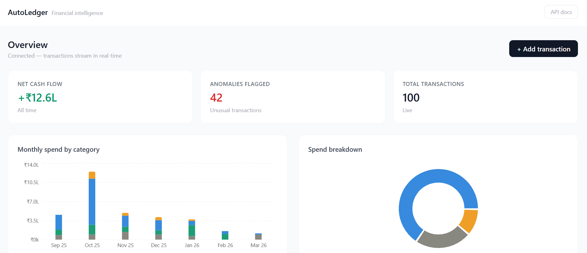

# AutoLedger — Real-time Financial Intelligence for Startups

> Automates bookkeeping for early-stage startups — ML transaction classifier, anomaly detection, cash flow forecasting, runway calculator, and a live React dashboard.



---

## The Problem

Every early-stage startup founder spends 10–20 hrs/month manually categorising bank transactions, reconciling expenses, and building P&L reports in Excel. AutoLedger replaces that entirely with an automated ML pipeline and a live dashboard.

---

## Features

| Feature | Details |
|---------|---------|
| Auto-categorisation | TF-IDF + Random Forest classifies transactions into 9 categories with confidence score |
| Explainable AI | Every classification shows the keywords that drove the decision + probability breakdown |
| Anomaly detection | Isolation Forest flags unusual transactions — large amounts, odd hours, weekends |
| Cash flow forecast | 30/60/90-day forecast with 80% confidence interval |
| Runway calculator | Live burn rate + months of runway remaining |
| Scenario modelling | Drag sliders to simulate cutting marketing/payroll/software spend |
| Real-time feed | WebSocket broadcasts every new transaction to the dashboard instantly |
| Alert rules | Set threshold rules — get notified when any expense exceeds a limit |
| REST API | Full CRUD with auto-generated Swagger docs at `/docs` |

---

## Tech Stack

| Layer | Tools |
|-------|-------|
| Backend | FastAPI, SQLAlchemy (async), asyncpg |
| ML | scikit-learn (TF-IDF + Random Forest), Isolation Forest |
| Forecasting | Weighted moving average with Prophet fallback |
| Queue | Celery + Redis |
| Database | PostgreSQL |
| Frontend | React 18, Vite, TailwindCSS, Recharts, Zustand |
| DevOps | Docker Compose, GitHub Actions |

---

## Quick Start
```bash
# 1. Clone
git clone https://github.com/mahakk24/autoledger
cd autoledger

# 2. Start all services
docker compose -f docker/docker-compose.yml up --build -d

# 3. Seed 100 realistic startup transactions
docker exec docker-api-1 python -c "
import httpx, asyncio, random
from datetime import datetime, timedelta

MERCHANTS = [
    ('AWS', -15000), ('Google Cloud', -12000), ('GitHub', -3000),
    ('Slack', -2000), ('Figma', -2500), ('Zoom', -1500),
    ('Employee Salary', -120000), ('Employee Salary Design', -90000),
    ('Facebook Ads', -25000), ('Google Ads', -30000),
    ('Office Rent', -80000), ('BESCOM Electricity', -5000),
    ('IndiGo Airlines', -12000), ('Uber Business', -1500),
    ('Client Invoice Acme', 150000), ('Client Invoice TechCo', 200000),
    ('SaaS Revenue', 80000),
]

async def run():
    async with httpx.AsyncClient(follow_redirects=True, timeout=30) as c:
        base = datetime.now() - timedelta(days=180)
        for i in range(100):
            m, amt = random.choice(MERCHANTS)
            amt = round(amt * random.uniform(0.8, 1.3), 2)
            d = base + timedelta(days=random.randint(0,180), hours=random.randint(9,18))
            await c.post('http://127.0.0.1:8000/api/v1/transactions/', json={
                'date': d.isoformat(), 'merchant': m,
                'amount': amt, 'currency': 'INR'
            })
            print(f'[{i+1}] {m} {amt}')

asyncio.run(run())
"

# 4. Open dashboard
open http://localhost:3000

# 5. Explore API docs
open http://localhost:8000/docs
```

---

## API Reference
```
POST   /api/v1/transactions/              Ingest transaction → auto-classify + anomaly check
GET    /api/v1/transactions/              Paginated transaction list
GET    /api/v1/transactions/{id}/explain  ML explanation — keywords + probability breakdown
GET    /api/v1/reports/pnl               Monthly P&L grouped by category
GET    /api/v1/reports/summary           Total amount, anomaly count, transaction count
GET    /api/v1/forecast/?days=30         Cash flow forecast with confidence intervals
GET    /api/v1/runway/                   Burn rate, runway months, scenario modelling
POST   /api/v1/alerts/rules              Create alert rule
GET    /api/v1/alerts/events             Triggered alert events
WS     /ws/live                          Real-time transaction WebSocket feed
```

Full interactive docs: http://localhost:8000/docs

---

## Project Structure
```
autoledger/
├── backend/
│   ├── app/
│   │   ├── api/routes/          # FastAPI endpoints
│   │   ├── ml/pipeline/         # classifier, anomaly detector, forecaster
│   │   ├── models/              # SQLAlchemy ORM models
│   │   ├── schemas/             # Pydantic schemas
│   │   └── services/            # Business logic
│   └── tests/
├── frontend/
│   └── src/
│       ├── components/
│       │   ├── dashboard/       # KpiCard, PnLChart, CategoryDonut
│       │   ├── transactions/    # TransactionFeed, ExplainModal, AddModal
│       │   ├── alerts/          # AlertsPanel
│       │   └── forecast/        # ForecastChart, RunwayCard
│       ├── pages/Dashboard.tsx
│       ├── services/api.ts
│       └── store/liveStore.ts
├── docker/
└── scripts/seed.py
```

---

## Modules Built

| Module | What was built |
|--------|---------------|
| 1 | Transaction ingestion pipeline — async FastAPI, PostgreSQL, WebSocket live feed |
| 2 | ML classifier with explainability — TF-IDF, Random Forest, keyword attribution |
| 3 | Runway calculator — burn rate, scenario modelling, cash flow forecasting |

---

## Resume Line

> *Built AutoLedger — real-time bookkeeping automation for startups. ML pipeline auto-classifies transactions into 9 categories with explainability, detects anomalies using Isolation Forest, forecasts 30-day cash flow, and calculates runway with live scenario modelling. FastAPI + React + Docker. [github.com/mahakk24/autoledger](https://github.com/mahakk24/autoledger)*
